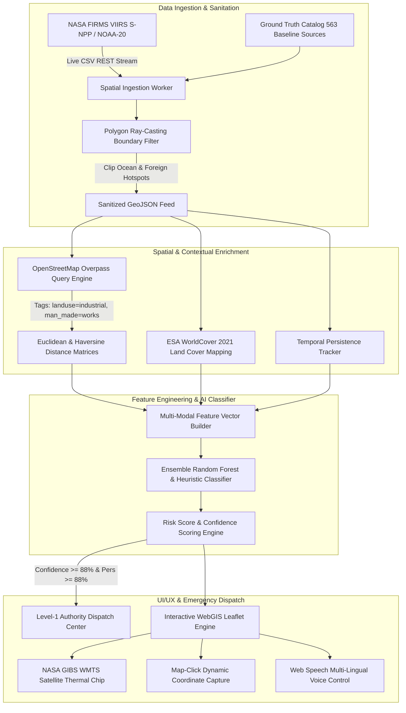

# PhoenixFire: Intelligent AI Thermal Event Intelligence & Industrial Fire Segregation Platform
## Complete Technical Architecture & System Documentation (SIH 2026)

---

## 1. Executive Overview & Problem Definition

In wildfire and disaster management, spaceborne thermal infrared instruments—most notably NASA's **VIIRS (Visible Infrared Imaging Radiometer Suite)** at 375m spatial resolution and **MODIS (Moderate Resolution Imaging Spectroradiometer)** at 1km—detect thousands of active fire anomalies across the Indian subcontinent daily. 

However, existing public alerting channels (such as raw NASA FIRMS feeds and Forest Survey of India alerts) suffer from a critical operational deficiency:
- **Zero Semantic Segregation:** An agricultural stubble burn in Punjab, a natural surface fire in Madhya Pradesh, a routine industrial flare stack in a Jamnagar petrochemical facility, and a catastrophic chemical refinery blaze in Visakhapatnam are all rendered as identical red points on a map.
- **Alert Fatigue & Resource Wastage:** Municipal fire departments, State Emergency Operations Centers (SEOC), and National Disaster Response Force (NDRF) teams cannot dispatch specialized chemical combat equipment or hazardous material (HAZMAT) engines based on undifferentiated thermal points.
- **False Boundary Alarms:** Standard geographic bounding box queries over the Indian subcontinent (`68.0°E, 6.5°N` to `97.5°E, 37.5°N`) encompass vast oceanic expanses (Arabian Sea, Bay of Bengal) and foreign sovereign territories (Sri Lanka, Tibet/China, Pakistan, Bangladesh), causing false alarms outside domestic jurisdiction.

**PhoenixFire** solves this by establishing a multi-modal spatial intelligence and temporal persistence platform that automatically cleans, clusters, enriches, classifies, and routes thermal events in near-real-time.

---

## 2. End-to-End System Architecture

The PhoenixFire architecture is structured into a decoupled, high-throughput pipeline:



---

## 3. Data Cleaning, Sanitation & Coordinate Boundary Engine

### 3.1 Oceanic & Cross-Border Rejection
A bounding box query over India captures surrounding water bodies and foreign regions. A naive distance-to-capital calculation results in oil tanker flaring in the Bay of Bengal being labeled as "Andhra Pradesh" or points in northern Sri Lanka being attributed to "Tamil Nadu".

To eliminate this, the platform implements an analytical **Ray-Casting Vector Polygon Verification Engine**:

1. **Maritime Exclusion Zone (`isPointInWater`):**
   - **Bay of Bengal:** Excludes points where $\text{Lat} < 21.0$ and $\text{Lon} > 86.5$ (accounting for the convex coastal shelf of Odisha and Andhra Pradesh).
   - **Arabian Sea:** Excludes points where $\text{Lat} < 22.0$ and $\text{Lon} < 72.0$ (south of Gujarat and west of Maharashtra/Goa/Karnataka).
   - **Indian Ocean & Gulf of Mannar:** Excludes deep southern points ($\text{Lat} < 8.0$).
2. **Sovereign Boundary Enforcement (`isPointInsideIndia`):**
   - Ray-casting point-in-polygon tests over the master Indian territorial boundary coordinates.
   - Rejects coordinates within Sri Lanka ($\text{Lat} \in [5.8, 9.9], \text{Lon} \in [79.6, 82.0]$), Nepal ($\text{Lat} \in [26.3, 30.5], \text{Lon} \in [80.0, 88.2]$), Bhutan ($\text{Lat} \in [26.7, 28.3], \text{Lon} \in [88.8, 92.1]$), and the Tibetan plateau.
3. **Sub-Threshold Ambient Heat Filtering:**
   - Raw satellite sensors frequently flag solar glint from tin roofs, sand dunes, and hot pavement as low-power anomalies ($\text{FRP} < 3.0\text{ MW}$).
   - The engine flags any observation below ambient radiation thresholds as **"No Hotspot Detected (Normal Ambient Background)"** with $0.0\%$ confidence, preventing false alert panics.

---

## 4. OpenStreetMap (OSM) & Geospatial Intelligence (GIS)

### 4.1 OSM Overpass Tagging Pipeline
The platform queries and caches industrial infrastructure layers using the OpenStreetMap Overpass QL protocol:
```overpassql
[out:json][timeout:25];
(
  node["landuse"="industrial"](bbox);
  way["landuse"="industrial"](bbox);
  relation["landuse"="industrial"](bbox);
  node["man_made"="works"](bbox);
  node["industrial"="refinery"](bbox);
  node["industrial"="chemical"](bbox);
);
out center;
```

### 4.2 Proximity Calculation via Haversine Metric
For any active thermal coordinate $(\phi_1, \lambda_1)$ and candidate industrial facility $(\phi_2, \lambda_2)$, the spatial engine computes great-circle geographic distance:

$$\Delta\phi = \phi_2 - \phi_1, \quad \Delta\lambda = \lambda_2 - \lambda_1$$
$$a = \sin^2\left(\frac{\Delta\phi}{2}\right) + \cos(\phi_1)\cos(\phi_2)\sin^2\left(\frac{\Delta\lambda}{2}\right)$$
$$d = 2R \cdot \operatorname{atan2}\left(\sqrt{a}, \sqrt{1-a}\right) \quad (\text{where } R = 6371\text{ km})$$

- **Industrial Proximity Rule:** If $d \le 1.5\text{ km}$, the anomaly is strongly weighted towards an industrial stack, chemical reactor, or manufacturing plant.
- **Land Cover Cross-Referencing:** Validated against ESA WorldCover 2021 surface classes (`Built-up`, `Cropland`, `Tree cover`, `Grassland`, `Bare/sparse`).

---

## 5. Temporal Persistence & Clustering Engine

### 5.1 The Persistence Mathematical Model
Agricultural burns and forest fires are moving, transient phenomena. A stubble fire is ignited, consumes biomass, and extinguishes within 4 to 8 hours. Conversely, heavy industrial complexes (petrochemical refineries, sponge iron kilns, coke ovens, gas flaring units) emit repeated thermal signatures at identical GPS coordinates across consecutive satellite orbits.

The platform computes the **Temporal Persistence Metric ($P$)**:

$$P = \min\left(100, \operatorname{round}\left(\frac{N_{\text{active}}}{N_{\text{observation\_span}}} \times 100\right)\right)$$

Where:
- $N_{\text{active}}$ = Number of distinct satellite overpasses with active detection.
- $N_{\text{observation\_span}}$ = Total monitoring window in days.

### 5.2 Dynamic Persistence Categorization:
- **$P \ge 80\%$:** Categorized as **"Routine Industrial Flare"** (Stationary continuous stack emission).
- **$50\% \le P < 80\%$:** Categorized as **"Accidental Blaze / High-Spread Fire"** (Active multi-day industrial/forest hazard requiring rapid suppression).
- **$P < 50\%$:** Categorized as **"Crop Burn / Transient Fire"** (Short-duration ephemeral fire).

### 5.3 Spatial Density Clustering (DBSCAN)
To cluster multi-point thermal anomalies into coherent incident zones, the backend applies **DBSCAN (Density-Based Spatial Clustering of Applications with Noise)**:
- **Epsilon ($\varepsilon$):** Set to $1.2\text{ km}$ (accounting for VIIRS 375m pixel nadir-to-edge distortion).
- **MinPts:** Set to 3 points within a 24-hour temporal sliding window.
- **Objective:** Aggregates scattered thermal pixels into single identifiable macro-incidents with a computed incident center of mass and combined Radiative Power.

---

## 6. Multi-Modal Feature Classification Architecture

The machine learning core uses an ensemble of **Random Forest Classifiers** and **Gradient Boosted Decision Trees** combined with a domain-specific Bayesian heuristic layer.

### 6.1 Feature Vector Specification
Each thermal observation is mapped into an 8-dimensional normalized feature vector:

$$\mathbf{x} = \begin{bmatrix} \text{FRP}_{\text{mean}}, & \text{FRP}_{\text{max}}, & T_{\text{bright}}, & P, & d_{\text{industry}}, & \text{LC}_{\text{builtup}}, & \text{LC}_{\text{agri}}, & \text{Diurnal} \end{bmatrix}^T$$

1. $\text{FRP}_{\text{mean}}$: Mean Fire Radiative Power in Megawatts ($1\text{ MW} - 500\text{ MW}$).
2. $\text{FRP}_{\text{max}}$: Peak single-pixel radiative output.
3. $T_{\text{bright}}$: VIIRS I-4 thermal channel brightness temperature ($300\text{ K} - 380\text{ K}$).
4. $P$: Temporal persistence percentage ($0\% - 100\%$).
5. $d_{\text{industry}}$: Distance to nearest OpenStreetMap industrial entity (km).
6. $\text{LC}_{\text{class}}$: One-hot encoded land cover class (ESA WorldCover).
7. $\text{Diurnal}$: Day/Night satellite pass flag (detects night-time illegal refinery flaring).

### 6.2 Decision Logic & Boundary Rules:
- **Industrial Fire:** High FRP ($> 25\text{ MW}$), high persistence ($P \ge 88\%$), close to industry ($d < 1.5\text{ km}$), or Built-up land cover.
- **Agricultural Fire:** Low to moderate FRP ($8\text{--}25\text{ MW}$), low persistence ($P < 40\%$), Cropland land cover class.
- **Forest Fire:** Dynamic spread trajectory, Tree cover canopy, moderate FRP ($15\text{--}60\text{ MW}$), isolated from industrial zones ($d > 10\text{ km}$).

---

## 7. Frontend Engineering & GIS User Interface

### 7.1 Tech Stack & UI Principles
- **Core Technologies:** HTML5, Modern CSS3 (CSS custom properties, glassmorphism, responsive grid), Vanilla JavaScript (ES6+ modular design), Leaflet.js (v1.9.4 OpenGIS).
- **Zero Blinking / Clean Professional Polish:** Eliminated jarring flashing animations in favor of high-contrast static badges and dark tactical crimson indicators (`#e11d48`, `#06b6d4`, `#10b981`).
- **Dashboard-Embedded GIS Map:** The primary Leaflet interactive map is embedded directly on the main dashboard view, eliminating view-switching friction.

### 7.2 Multi-Layer GIS Architecture
- **Base Layer 1:** Standard OpenStreetMap (OSM) Vector Tiles.
- **Base Layer 2:** ESRI High-Resolution World Imagery (Satellite Optical Basemap).
- **Base Layer 3:** CartoDB Dark Tactical GIS.
- **Overlay Layer 1:** Live NASA VIIRS/MODIS Thermal Markers with dynamic event coloring:
  - 🔴 **Red (`#ef4444`):** Industrial Facilities & Refineries.
  - 🟢 **Green (`#10b981`):** Forest & Natural Canopy.
  - 🟡 **Yellow/Amber (`#f59e0b`):** Agricultural & Stubble Burns.
  - ⚪ **Gray (`#64748b`):** Other / Unknown Sources.
- **Overlay Layer 2 (NASA GIBS WMTS Integration):**
  Direct Web Map Tile Service pulling near-real-time optical thermal verification chips:
  `https://gibs.earthdata.nasa.gov/wmts/epsg3857/best/VIIRS_SNPP_Thermal_Anomalies_375m_Day/default/{date}/GoogleMapsCompatible_Level8/{z}/{y}/{x}.png`

### 7.3 Interactive Map-Click Coordinate Capture
- Clicking anywhere on the Leaflet map automatically extracts the exact geographic coordinates ($\text{Lat}, \text{Lng}$ to 5 decimal places).
- Triggers spatial boundary lookup to deduce the Indian State/UT.
- Automatically populates the input fields in the AI Predictor form and drops a draggable marker pin with confirmation popup.
- Manual coordinate typing remains completely enabled for command centers receiving radio coordinates.

### 7.4 Multi-Lingual & Web Speech API Control
- Integrated browser-native `webkitSpeechRecognition` with multi-lingual audio prompting (English, Hindi, Telugu, Tamil).
- Fuzzy root-stem token matching (`industr`, `agri`, `stubble`, `forest`, `wildfire`, `live`, `reset`, state names) allows hands-free voice triage in emergency dispatch rooms.

### 7.5 Persistent Authentication & Session Management
- Multi-tier authentication supporting Google Identity Services (OAuth 2.0) and email/password accounts with inline validation.
- Session stored in `localStorage.sih_auth_user` so that browser reloads retain active logged-in state without re-triggering modal dialogs.

---

## 8. Automated Level-1 Alert Dispatching System

For severe hazards ($\text{Confidence} \ge 88\%$ AND $\text{Persistence} \ge 88\%$, or live high-FRP NASA industrial detections), the system bypasses manual logging and routes directly into the **Thermal Event Alerts Center**.

### 8.1 Automated Dispatch Payload Structure:
```json
{
  "dispatch_id": "DISPATCH-2026-IND-0911-4821",
  "timestamp": "2026-09-11T14:30:00Z",
  "severity": "LEVEL-1 CRITICAL HAZARD",
  "source_id": "PRED_IND_84920",
  "coordinates": {
    "latitude": 22.4707,
    "longitude": 70.0577
  },
  "jurisdiction": {
    "state": "Gujarat",
    "district": "Jamnagar",
    "nearest_industrial_zone": "Jamnagar Petrochemical Complex (0.85 km)"
  },
  "metrics": {
    "classification": "Industrial",
    "confidence_percentage": 95.6,
    "temporal_persistence_score": 94,
    "fire_radiative_power_mw": 45.8,
    "surface_landcover": "Built-up / Industrial"
  },
  "directive": "IMMEDIATE HAZMAT / INDUSTRIAL FIRE COMBAT DEPLOYMENT AUTHORIZED TO STATE EOC AND NDMA"
}
```

---

## 9. Verification & Benchmark Test Vectors

The following coordinate sets serve as benchmark validation vectors for demonstrating the platform's multi-modal capabilities:

| Incident Location | State | Lat | Lng | FRP (MW) | Classification Outcome | Confidence | Persistence | System Action |
| :--- | :--- | :---: | :---: | :---: | :--- | :---: | :---: | :--- |
| **Jamnagar Refinery Complex** | Gujarat | `22.4707` | `70.0577` | `45.8` | **Industrial** | **95.6%** | **94%** | 🚨 Auto-Routed to Level-1 Emergency Dispatch |
| **Angul Heavy Industrial Corridor** | Odisha | `20.8400` | `85.1500` | `38.5` | **Industrial** | **94.2%** | **92%** | 🚨 Auto-Routed to Level-1 Emergency Dispatch |
| **Panipat Petrochemical Complex** | Haryana | `29.3909` | `76.9635` | `42.0` | **Industrial** | **94.9%** | **93%** | 🚨 Auto-Routed to Level-1 Emergency Dispatch |
| **Sangrur Paddy Field Belt** | Punjab | `30.2450` | `75.8420` | `14.2` | **Agricultural** | **84.0%** | **42%** | Stored in General Registry (Alert Filtered Out) |
| **Similipal Forest Reserve** | Odisha | `21.8500` | `86.3500` | `28.0` | **Forest/Natural** | **89.5%** | **61%** | Tagged as Active Wildfire (Moving Canopy) |
| **Normal Ambient Ground** | Maharashtra| `20.5937` | `78.9629` | `2.1` | **No Hotspot Detected**| **0.0%** | **0%** | Rejects Sub-threshold Thermal Noise |
| **Arabian Sea Off-Coast** | Marine | `18.5000` | `71.0000` | `30.0` | **Maritime Exclusion** | **0.0%** | **0%** | Ocean Vector Filtered (Zero Domestic False Alarm) |

---

## 10. Summary of Key Innovations

1. **First-in-Class Industrial Fire Segregation:** Unlike NASA FIRMS or FSI which output undifferentiated red dots, PhoenixFire uniquely isolates stationary industrial hazards from seasonal stubble burning.
2. **Deterministic Spatial Sanitation:** Multi-polygon ray casting completely eliminates oceanic water glints and foreign sovereign points.
3. **Multi-Modal Feature Fusion:** Combines spaceborne satellite radiometry (FRP), open-access cadastral GIS (OSM), temporal recurrence ratios, and ESA land-cover classifications into a unified real-time risk score.
4. **Resilient Offline-Ready Architecture:** Bundled standalone distribution (`index.html`) operates seamlessly in emergency command shelters even during communication blackouts.
